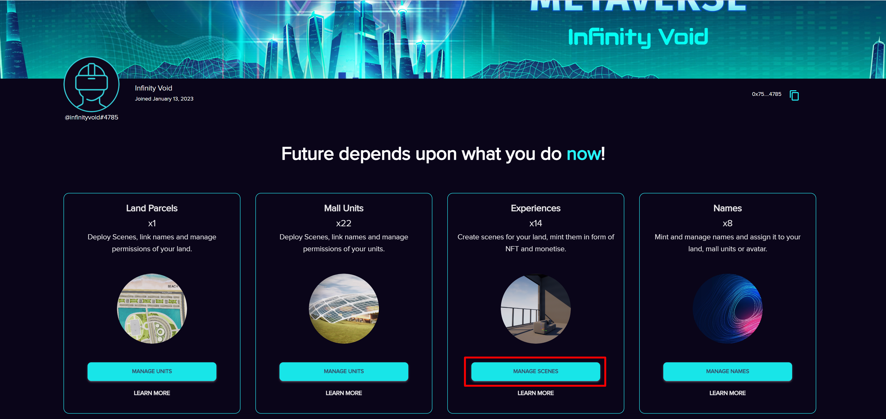

# Deploying Scene

**Effortless Scene Deployment with Void Craft: A Guided Approach**

A `scene` is a 3D experience or environment that can be either created within the Void Craft platform or imported/uploaded from external sources like Unreal Engine.

All created scenes are located in the `Experiences` tab on the dashboard.

<figure><figcaption></figcaption></figure>

In order to deploy your scene

<figure><figcaption></figcaption></figure>

1. Navigate to `Dashboard` > `Virtual Land Parcel` > `Settings`
2. Within the settings page of your virtual land parcel, locate the `Deploy Scene` dropdown menu.
3. Click on the dropdown button within the Deploy Scene option to view a list of scenes compatible with your land parcel.&#x20;
4. Choose the 3D scene you wish to deploy from the available options in the dropdown menu.
5. After selecting the desired scene, make sure to save your changes by clicking the `Save` button at the bottom of the page.


If you want to know how to access the settings page of your land then visit [#navigating-to-settings-page-of-land-parcel](land-parcel-customization/#navigating-to-settings-page-of-land-parcel "mention")

