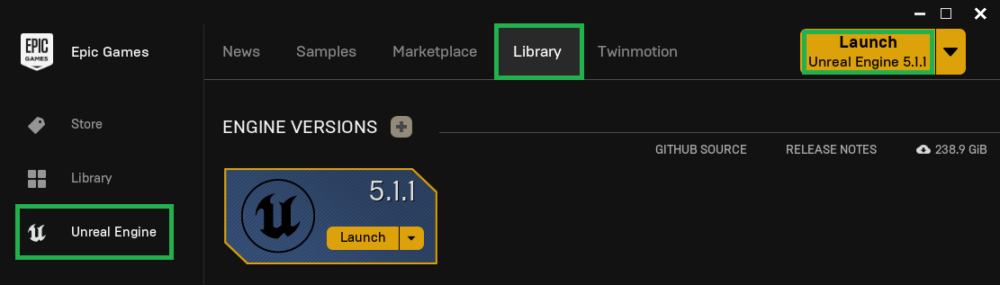
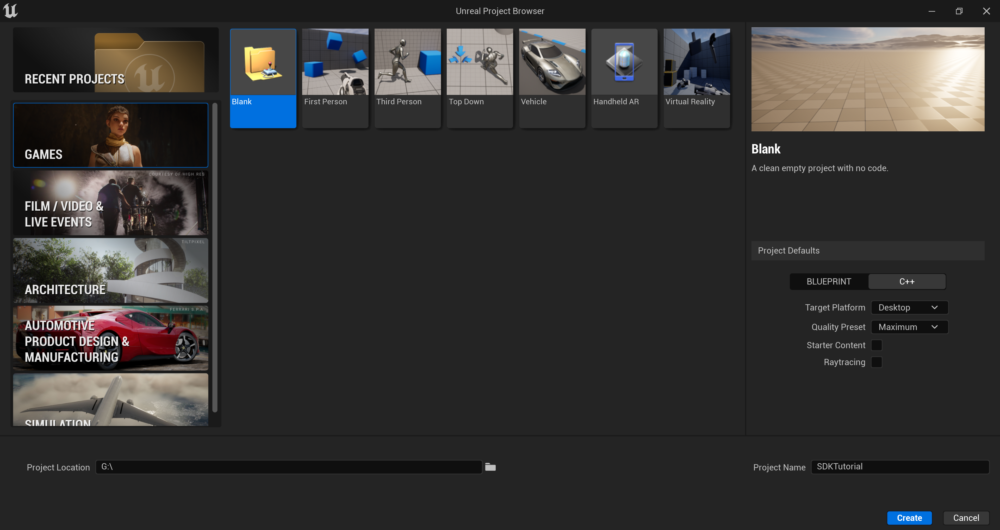

# Getting Started

Before embarking on the journey of deploying your Unreal project on Infinity Void, it's imperative to ensure that you've met the necessary prerequisites. These foundational steps lay the groundwork for a successful and seamless deployment process. Let's explore each prerequisite in detail:

### Installing Visual Studio[​](https://docs.inworld.ai/docs/tutorial-integrations/unreal-engine/getting-started/#installing-visual-studio) 


You may use an alternative IDE, such as Rider. However, for this set-up guide we will use Visual Studio.


Download the [**Visual Studio Installer**](https://visualstudio.microsoft.com/downloads/).

Ensure that you have the required Workloads and C++ tools specified [**here**](https://docs.unrealengine.com/5.1/en-US/setting-up-visual-studio-development-environment-for-cplusplus-projects-in-unreal-engine/). If you already have Visual Studio installed, you may open the installer and select 'Modify' to add these workloads and tools.

### Installing Unreal Engine 5 


You may also use the source build of Unreal Engine. However, for this set-up guide we will use the binary build of Unreal Engine downloaded using Epic Games Launcher


Download the [**Unreal Engine 5**](https://www.unrealengine.com/en-US/download).

### Creating a Project[​](https://docs.inworld.ai/docs/tutorial-integrations/unreal-engine/getting-started/#creating-a-project) 


Your project must be a 'C++' project. 'Blueprint' projects can be converted to C++ projects by creating a [**Game Module**](https://docs.unrealengine.com/5.1/en-US/how-to-make-a-gameplay-module-in-unreal-engine/) with the same name as your project.


Open the [**Epic Games Launcher**](https://store.epicgames.com/en-US/download), and navigate to `Unreal Engine` > `Library`.

<figure><figcaption></figcaption></figure>

Either open a project you've already created or create a new project by selecting your desired template. This set-up guide will use the 'Blank' template found under `Games` > `Blank`.

<figure><figcaption></figcaption></figure>

Once created, your project folder should be populated a Visual Studio .sln file, and your Unreal Engine .uproject file.

### Install Infinity Void SDK to the Project 


You must have a `Plugins` folder in your project directory. If one does not already exist, you will need to create one.


Download the plugins from the following page found [**here**](https://github.com/infinity-void-metaverse/infinityvoid-unreal-sdk)

This download contains he Infinity Void plugin along with some other dependents plugins [gLTFRuntime](https://github.com/rdeioris/glTFRuntime), [Fetch](https://github.com/GDi4K/unreal-fetch), [Ready Player Me](https://docs.readyplayer.me/ready-player-me/integration-guides/unreal-engine).&#x20;

Ensure that your Unreal Engine project is not running by closing the Editor, or by stopping the process from Visual Studio.

Place the downloaded folders inside plugins folder inside your projects `Plugins` directory.

Once the desired plugins are installed, simply double-click your projects .uproject file to open the Unreal Editor. You will be prompted to build the modules. Select 'Yes', and after a short while, the modules will be built and the Editor will open.


If building from Visual Studio, right-click your .uproject file and select 'Generate Visual Studio project files'. After a short while, your .sln file will be updated. Simply open the Visual Studio Solution, and build the project.


### Creating an Account 

Integrating your Unreal project into Infinity Void's interconnected virtual world requires an active Infinity Void account. If you haven't already created an account, it's essential to [sign up](https://dashboard.infinityvoid.io/).


Please ensure that the account used has access to the land parcel or has purchased/subscribed to a land parcel.

