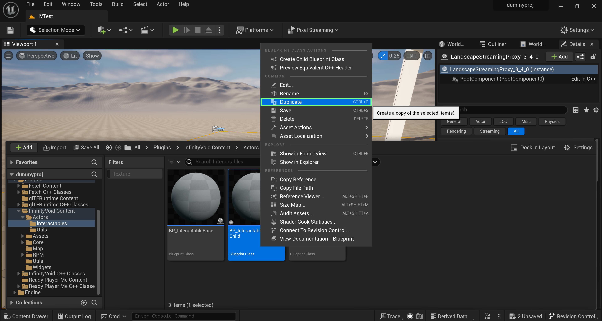
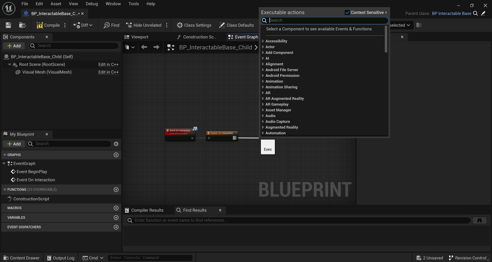
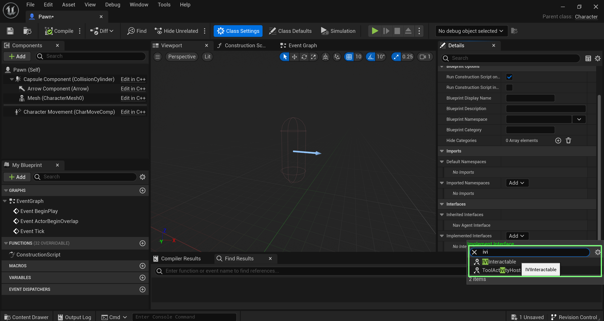

# Interactable Elements

**Infinity Void SDK** offers built-in functionality for enabling interaction with elements within your scene. To make actors interactable, there are two methods available:

### **BP\_InteractableBaseChild**

This blueprint simplifies the process of creating interactive elements in your scene. Here are the steps to make an actor interactable:

a. Duplicate the BP\_InteractableBaseChild blueprint.

<figure><figcaption></figcaption></figure>

b. Open the blueprint editor.

c. Select the visual mesh you want to make interactable.

<figure><figcaption></figcaption></figure>

d. Drag and drop the actor into your scene.

Inside the blueprint, you have the flexibility to:

* Add custom logic for interactions.

<figure><figcaption></figcaption></figure>

* Modify the displayed text when the user aims at the object.
* Toggle interactability using a boolean, which can be useful for scenarios where you want to restrict user interaction with the actor based on certain events or conditions.

<figure><figcaption></figcaption></figure>

### **IVIInteractable Interface**

If you want to make a class interactable other than actors, such as pawns, you can do so by following these steps:

To begin, navigate to the custom class you have created and open it.

If you wish to make this class interactable, rather than actor classes, follow these steps:

a. Open Class which you would like to make interactable.

b. Under Class Settings scroll down the Interface section, select `IVIInteractable`.

<figure><figcaption></figcaption></figure>

c. Implement your unique interaction logic in the event graph.

<figure><figcaption></figcaption></figure>
