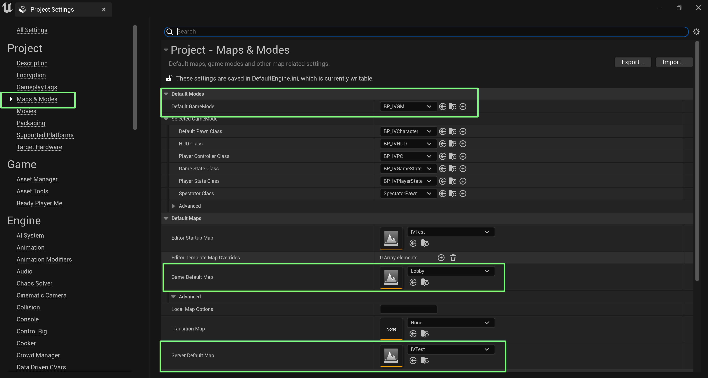
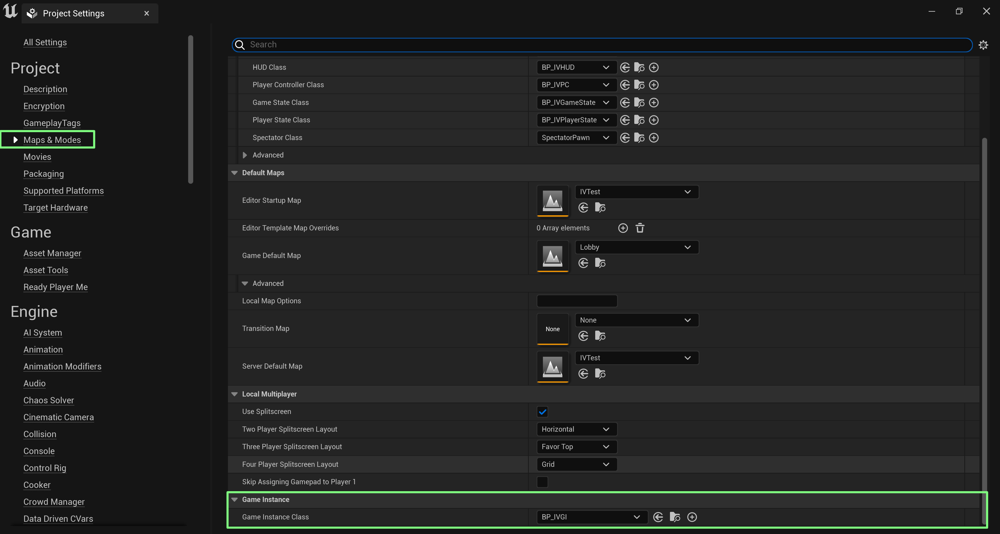
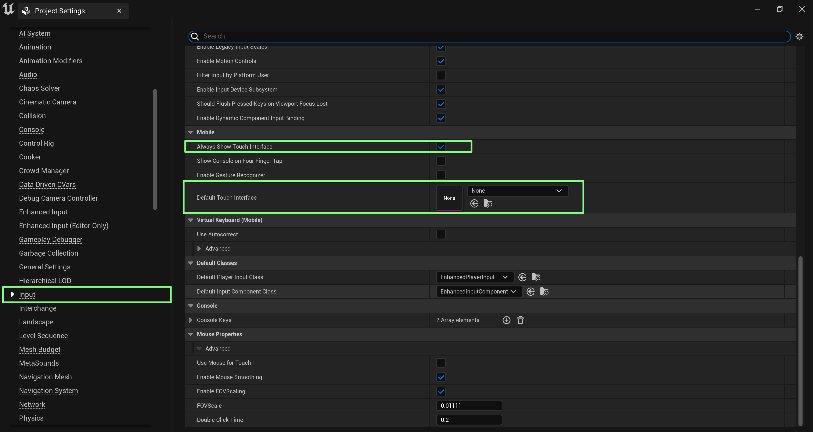

# Project Settings

The settings mentioned on this page are crucial to ensure the proper functionality of your project. Please follow the instructions below to modify the necessary settings.

### Maps & Modes

In the "Project Settings" section, locate the `Maps and Modes` category. Here, you will make several important changes.

**Default Game Mode**

Set "Default Game Mode" to `BP_IVGM`

**Game Default Map**

Set "Game Default Map" to `Lobby`

**Server Default Map**

Choose the map you've created for your game experience and set it as the Server Default Map.

<figure><figcaption>
Map Settings
</figcaption></figure>

#### Game Instance Settings

Scroll down to the "Game Instance" section.

* Set `Game Instance Class` to **`BP_IVGI`**

<figure><figcaption>
Game Instance Class
</figcaption></figure>

### Input Settings

Still within the "Project Settings" section, locate the "Touch Interface" category.

**Always Show Touch Interface**

Set `Always Show Touch Interface` to **`True`**

**Default Touch Interface**

Set `Default Touch Interface` to **`none`**

<figure><figcaption>
Input Settings
</figcaption></figure>
