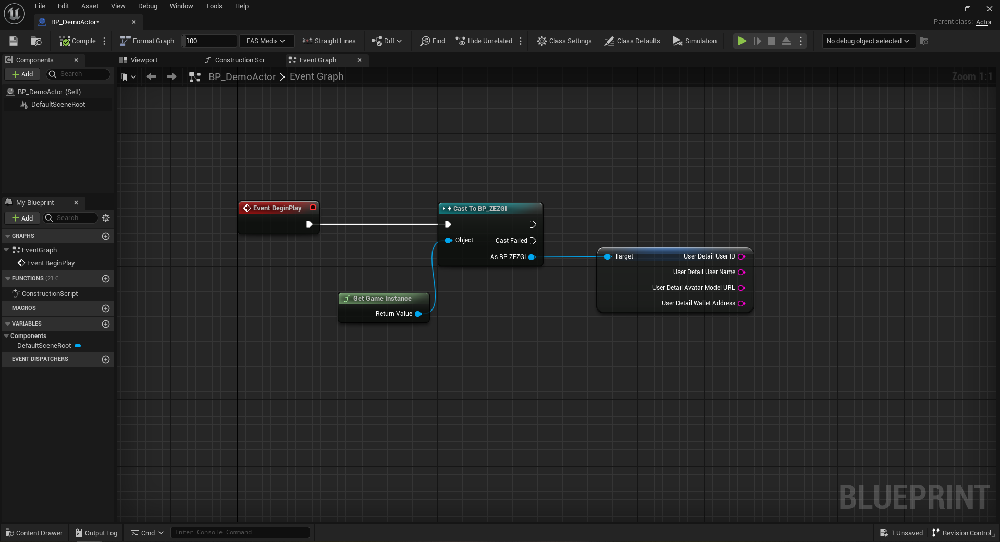
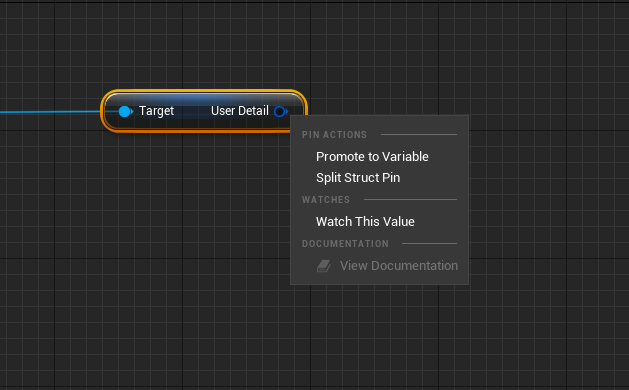

# BP\_IVGI

The BP\_IVGI class, also known as the Game Instance class, plays a crucial role in the Infinity Void SDK. It serves as a container for storing information that needs to remain constant throughout the game, regardless of the current level or gameplay state. This class allows for convenient access to important variables that are relevant to the overall game experience.

Within the BP\_IVGI class, you can find variables such as `{User Detail User ID}`, `{User Detail User Name}`, `{User Detail Avatar Model URL}`, `{User Detail Wallet Address}` . These variables hold essential data that can be accessed and utilized throughout the game.&#x20;

1. User Detail User ID:
   * This variable stores the unique identifier (ID) associated with the user. It serves as a unique reference for the user's account within the Infinity Void Metaverse.
   * The User ID is typically used for various backend operations, authentication, and identification purposes. It allows you to uniquely identify and manage user-specific data and interactions.
2. User Detail User Name:
   * This variable holds the username or display name of the user. It represents the name by which the user is identified within the Infinity Void Metaverse.
   * The User Name can be utilized for displaying personalized information, leaderboards, chat systems, or any other in-game features that require identifying the user by name.
3. User Detail Avatar Model URL:
   * This variable stores the URL or reference to the 3D model file of Ready Player Me avatars that represents the user's avatar within the Infinity Void Metaverse.&#x20;
   * By accessing this URL, you can retrieve the user's avatar model and render it within the game. This allows for the customization and visual representation of the user's virtual identity.
4. User Detail Wallet Address:
   * This variable holds the wallet address associated with the user's virtual wallet within the Infinity Void Metaverse.
   * The Wallet Address can be used for in-game transactions, virtual currency management, or any other financial interactions within the game.

By accessing these variables through the game instance, you can access and utilize this important information within various aspects of your game.


Example: You can use the UserId for backend operations or leaderboards, or interact with the virtual wallet address for in-game transactions.


&#x20;If you need to access the user detail variables mentioned above in any other blueprints, you can follow these steps:

<figure><figcaption>
Getting Variables From Game Instance
</figcaption></figure>

1. Cast Function:
   * Begin by adding a Cast node in the blueprint where you want to access the user detail variables.
   * Connect the object you want to cast from (get game instance) to the "Object" input of the Cast node.
2. Cast to BP\_ZEZGI:
   * From the "Class" dropdown in the Cast node, select BP\_ZEZGI to cast to the BP\_ZEZGI class.
   * This allows you to access the user detail variables stored in the BP\_ZEZGI instance.
3.  Get User Detail Variable:

    * After casting to BP\_ZEZGI, you can use a Get node to retrieve the specific user detail variable you need.
    * Right-click on the BP\_ZEZGI reference output of the Cast node, and from the context menu, select "Split Struct Pin"&#x20;

    

    <figure><figcaption>
Split Struct Pin
</figcaption></figure>

    

By splitting the struct pin, you can access individual components of the user detail variable, such as User ID, User Name, Avatar Model URL, or Wallet Address, separately. This allows you to utilize the specific information as required in your blueprint logic.

If you desire to create your own database, you can leverage the variables stored in the game instance. By retrieving these variables, you can send the data to your custom database or use them as references for data retrieval and storage operations.

The BP\_ZEZGI class provides a centralized and efficient way to manage and access important game-related information that persists throughout the entire gameplay experience. Leveraging this class and its variables can enhance the customization and functionality of your game within the Infinity Void Metaverse.


Note: Existing variables inside this class shouldn't be modified. However, new variables can be added to this class according to your requirements.

